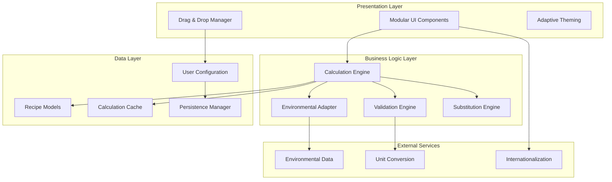
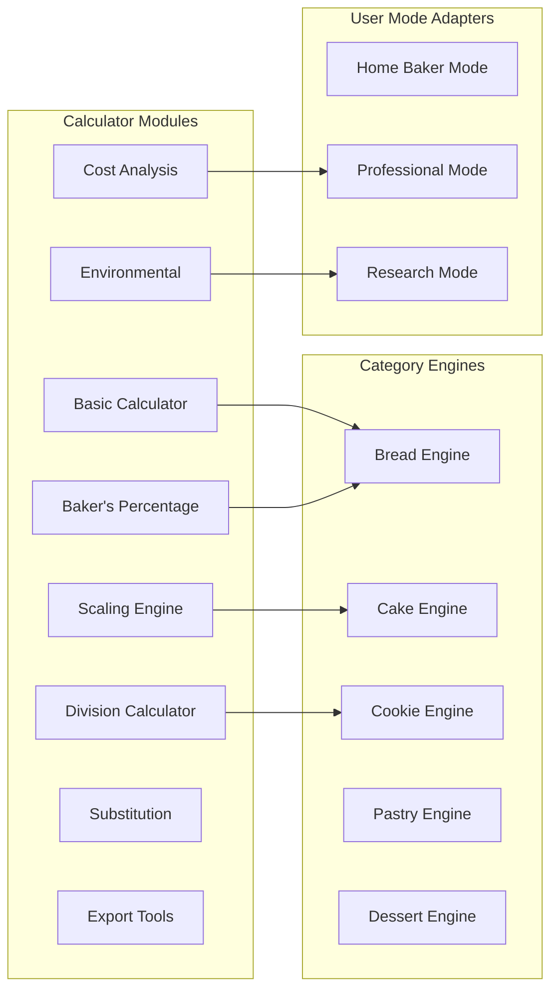
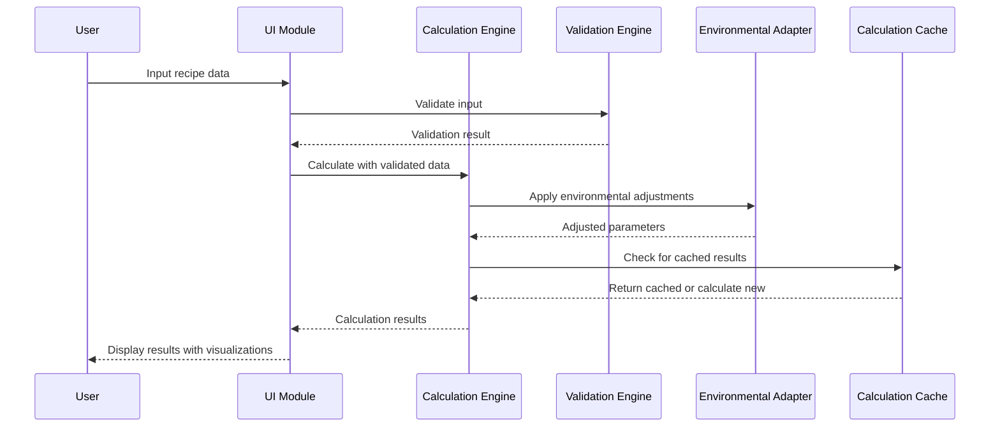

# Advanced Baking Calculator Design

## Overview

The Advanced Baking Calculator represents a complete transformation of the existing recipe detail page calculator into a comprehensive, intelligent baking assistant. This system integrates scientific baking principles, professional-grade calculations, and adaptive user interfaces to serve bakers from home enthusiasts to research professionals. The design emphasizes modularity, extensibility, and scientific accuracy while maintaining intuitive usability.

## Architecture

### High-Level System Architecture



### Modular Component Architecture



### Data Flow Architecture



## Components and Interfaces

### Core Calculation Engine

#### BakingCalculationEngine Class

```dart
class BakingCalculationEngine {
  final EnvironmentalAdapter environmentalAdapter;
  final ValidationEngine validator;
  final SubstitutionEngine substitutionEngine;
  final CalculationCache cache;
  
  // Core calculation methods
  BakingResult calculateBasicScaling(Recipe recipe, double scale);
  BakingResult calculateBakersPercentage(Recipe recipe);
  BakingResult calculateHydrationAdjustment(Recipe recipe, double targetHydration);
  BakingResult calculateEnvironmentalAdjustment(Recipe recipe, EnvironmentalConditions conditions);
  BakingResult calculateCostAnalysis(Recipe recipe, Map<String, double> ingredientCosts);
  
  // Category-specific calculations
  BreadCalculationResult calculateBreadSpecific(Recipe recipe, BreadParameters params);
  CakeCalculationResult calculateCakeSpecific(Recipe recipe, CakeParameters params);
  CookieCalculationResult calculateCookieSpecific(Recipe recipe, CookieParameters params);
  PastryCalculationResult calculatePastrySpecific(Recipe recipe, PastryParameters params);
  DessertCalculationResult calculateDessertSpecific(Recipe recipe, DessertParameters params);
  
  // Advanced features
  List<IngredientSubstitution> suggestSubstitutions(String ingredient, DietaryRestrictions restrictions);
  FermentationSchedule calculateFermentationTiming(Recipe recipe, EnvironmentalConditions conditions);
  YieldPrediction calculateYieldPrediction(Recipe recipe, BakingConditions conditions);
}
```

#### Environmental Adaptation System

```dart
class EnvironmentalAdapter {
  // Altitude adjustments
  Recipe adjustForAltitude(Recipe recipe, double altitudeMeters) {
    if (altitudeMeters < 300) return recipe;
    
    double adjustmentFactor = altitudeMeters / 300;
    return recipe.copyWith(
      ingredients: recipe.ingredients.map((ingredient) {
        return _adjustIngredientForAltitude(ingredient, adjustmentFactor);
      }).toList(),
      bakingTemperature: recipe.bakingTemperature + (10 * adjustmentFactor).round(),
      bakingTime: Duration(
        minutes: (recipe.bakingTime.inMinutes * (1 - 0.05 * adjustmentFactor)).round()
      ),
    );
  }
  
  // Humidity adjustments
  Recipe adjustForHumidity(Recipe recipe, double humidityPercent) {
    double baseHumidity = 60.0;
    double humidityDiff = humidityPercent - baseHumidity;
    
    if (humidityDiff.abs() < 10) return recipe; // No adjustment needed
    
    return recipe.copyWith(
      ingredients: recipe.ingredients.map((ingredient) {
        return _adjustIngredientForHumidity(ingredient, humidityDiff);
      }).toList(),
    );
  }
  
  // Oven type adjustments
  Recipe adjustForOvenType(Recipe recipe, OvenType ovenType) {
    switch (ovenType) {
      case OvenType.convection:
        return recipe.copyWith(
          bakingTemperature: recipe.bakingTemperature - 15,
          bakingTime: Duration(minutes: (recipe.bakingTime.inMinutes * 0.8).round()),
        );
      case OvenType.steam:
        return recipe.copyWith(
          bakingTemperature: recipe.bakingTemperature - 10,
          bakingTime: Duration(minutes: (recipe.bakingTime.inMinutes * 1.15).round()),
        );
      case OvenType.gas:
        return recipe.copyWith(
          bakingTemperature: recipe.bakingTemperature + 10,
          bakingTime: Duration(minutes: (recipe.bakingTime.inMinutes * 0.9).round()),
        );
      default:
        return recipe;
    }
  }
}
```

### Modular UI System

#### DragDropCalculatorLayout

```dart
class DragDropCalculatorLayout extends StatefulWidget {
  final Recipe recipe;
  final UserMode userMode;
  final BakingCategory category;
  final List<CalculatorModule> availableModules;
  final Function(List<CalculatorModule>) onLayoutChanged;
  
  @override
  _DragDropCalculatorLayoutState createState() => _DragDropCalculatorLayoutState();
}

class _DragDropCalculatorLayoutState extends State<DragDropCalculatorLayout> {
  List<CalculatorModule> activeModules = [];
  Map<String, Offset> modulePositions = {};
  
  @override
  Widget build(BuildContext context) {
    return Stack(
      children: [
        // Grid background for drop zones
        _buildDropZoneGrid(),
        
        // Active modules
        ...activeModules.map((module) => _buildDraggableModule(module)),
        
        // Module palette
        _buildModulePalette(),
        
        // Layout controls
        _buildLayoutControls(),
      ],
    );
  }
  
  Widget _buildDraggableModule(CalculatorModule module) {
    return Positioned(
      left: modulePositions[module.id]?.dx ?? 0,
      top: modulePositions[module.id]?.dy ?? 0,
      child: Draggable<CalculatorModule>(
        data: module,
        feedback: _buildModuleFeedback(module),
        childWhenDragging: _buildModulePlaceholder(module),
        child: _buildModuleContent(module),
        onDragEnd: (details) => _handleModuleDrop(module, details),
      ),
    );
  }
  
  Widget _buildModuleContent(CalculatorModule module) {
    switch (module.type) {
      case ModuleType.basicCalculator:
        return BasicCalculatorModule(
          recipe: widget.recipe,
          onCalculationChanged: _handleCalculationUpdate,
        );
      case ModuleType.bakersPercentage:
        return BakersPercentageModule(
          recipe: widget.recipe,
          onPercentageChanged: _handlePercentageUpdate,
        );
      case ModuleType.environmentalAdjustment:
        return EnvironmentalAdjustmentModule(
          recipe: widget.recipe,
          onEnvironmentChanged: _handleEnvironmentUpdate,
        );
      // ... other module types
      default:
        return Container();
    }
  }
}
```

#### Adaptive User Mode System

```dart
class UserModeAdapter {
  static Widget adaptModuleForUserMode(CalculatorModule module, UserMode mode) {
    switch (mode) {
      case UserMode.homeBaker:
        return _adaptForHomeBaker(module);
      case UserMode.professional:
        return _adaptForProfessional(module);
      case UserMode.research:
        return _adaptForResearch(module);
    }
  }
  
  static Widget _adaptForHomeBaker(CalculatorModule module) {
    return Card(
      elevation: 2,
      child: Padding(
        padding: EdgeInsets.all(16),
        child: Column(
          crossAxisAlignment: CrossAxisAlignment.start,
          children: [
            // Simplified title with help icon
            Row(
              children: [
                Text(module.friendlyTitle, style: TextStyle(fontSize: 18, fontWeight: FontWeight.bold)),
                IconButton(
                  icon: Icon(Icons.help_outline),
                  onPressed: () => _showHelpDialog(module.helpText),
                ),
              ],
            ),
            
            // Simplified controls with presets
            _buildSimplifiedControls(module),
            
            // Visual feedback with icons and colors
            _buildVisualFeedback(module),
            
            // Common unit conversions
            _buildUnitConversions(module),
          ],
        ),
      ),
    );
  }
  
  static Widget _adaptForProfessional(CalculatorModule module) {
    return Card(
      elevation: 4,
      child: Padding(
        padding: EdgeInsets.all(12),
        child: Column(
          crossAxisAlignment: CrossAxisAlignment.start,
          children: [
            // Professional title with technical details
            Text(module.technicalTitle, style: TextStyle(fontSize: 16, fontWeight: FontWeight.w600)),
            
            // Advanced controls with precise inputs
            _buildAdvancedControls(module),
            
            // Technical readouts and graphs
            _buildTechnicalReadouts(module),
            
            // Batch scaling and cost analysis
            _buildBatchControls(module),
          ],
        ),
      ),
    );
  }
  
  static Widget _adaptForResearch(CalculatorModule module) {
    return Card(
      elevation: 6,
      child: Padding(
        padding: EdgeInsets.all(8),
        child: Column(
          crossAxisAlignment: CrossAxisAlignment.start,
          children: [
            // Scientific title with precision indicators
            Text(module.scientificTitle, style: TextStyle(fontSize: 14, fontWeight: FontWeight.w500)),
            
            // High-precision controls (0.1g accuracy)
            _buildPrecisionControls(module),
            
            // Scientific calculations and formulas
            _buildScientificReadouts(module),
            
            // Experimental features and data export
            _buildExperimentalFeatures(module),
          ],
        ),
      ),
    );
  }
}
```

### Category-Specific Calculation Engines

#### Bread Calculation Engine

```dart
class BreadCalculationEngine extends CategoryCalculationEngine {
  @override
  BreadCalculationResult calculate(Recipe recipe, BreadParameters params) {
    // Baker's percentage calculations
    Map<String, double> bakersPercentages = _calculateBakersPercentages(recipe);
    
    // Hydration calculations
    double currentHydration = _calculateHydration(recipe);
    double targetHydration = params.targetHydration ?? currentHydration;
    
    // Fermentation timing
    FermentationSchedule fermentation = _calculateFermentationSchedule(
      recipe, 
      params.temperature, 
      params.yeastType,
      params.desiredFlavor
    );
    
    // Scaling with non-linear adjustments
    Recipe scaledRecipe = _scaleWithBreadAdjustments(recipe, params.scale);
    
    return BreadCalculationResult(
      originalRecipe: recipe,
      scaledRecipe: scaledRecipe,
      bakersPercentages: bakersPercentages,
      currentHydration: currentHydration,
      targetHydration: targetHydration,
      fermentationSchedule: fermentation,
      yieldPrediction: _calculateYield(scaledRecipe),
    );
  }
  
  Map<String, double> _calculateBakersPercentages(Recipe recipe) {
    double flourWeight = _getTotalFlourWeight(recipe);
    Map<String, double> percentages = {};
    
    for (var ingredient in recipe.ingredients) {
      String name = ingredient['name'];
      double amount = ingredient['amount'];
      percentages[name] = (amount / flourWeight) * 100;
    }
    
    return percentages;
  }
  
  double _calculateHydration(Recipe recipe) {
    double flourWeight = _getTotalFlourWeight(recipe);
    double liquidWeight = _getTotalLiquidWeight(recipe);
    return (liquidWeight / flourWeight) * 100;
  }
  
  FermentationSchedule _calculateFermentationSchedule(
    Recipe recipe, 
    double temperature, 
    YeastType yeastType,
    FlavorProfile desiredFlavor
  ) {
    // Base fermentation time at 25°C
    Duration baseTime = Duration(hours: 2);
    
    // Temperature adjustment (exponential relationship)
    double tempFactor = math.pow(2, (temperature - 25) / 10);
    Duration adjustedTime = Duration(minutes: (baseTime.inMinutes / tempFactor).round());
    
    // Yeast type adjustment
    double yeastFactor = yeastType == YeastType.active ? 1.0 : 
                        yeastType == YeastType.instant ? 0.8 : 1.5; // sourdough
    
    // Flavor development adjustment
    double flavorFactor = desiredFlavor == FlavorProfile.mild ? 1.0 :
                         desiredFlavor == FlavorProfile.developed ? 1.5 : 2.0; // complex
    
    Duration finalTime = Duration(
      minutes: (adjustedTime.inMinutes * yeastFactor * flavorFactor).round()
    );
    
    return FermentationSchedule(
      bulkFermentation: Duration(minutes: (finalTime.inMinutes * 0.7).round()),
      finalProof: Duration(minutes: (finalTime.inMinutes * 0.3).round()),
      temperature: temperature,
      totalTime: finalTime,
    );
  }
}
```

#### Cake Calculation Engine

```dart
class CakeCalculationEngine extends CategoryCalculationEngine {
  @override
  CakeCalculationResult calculate(Recipe recipe, CakeParameters params) {
    // Pan size conversions
    PanConversion panConversion = _calculatePanConversion(
      recipe.originalPanSize, 
      params.targetPanSize
    );
    
    // Serving calculations
    ServingCalculation servings = _calculateServings(
      params.targetPanSize,
      params.servingSize,
      params.layers
    );
    
    // Decoration material estimates
    DecorationEstimate decoration = _calculateDecorationNeeds(
      params.targetPanSize,
      params.decorationType,
      params.layers
    );
    
    // Baking time and temperature adjustments
    BakingAdjustment bakingAdjustment = _calculateBakingAdjustment(
      recipe.originalPanSize,
      params.targetPanSize,
      params.panMaterial
    );
    
    return CakeCalculationResult(
      originalRecipe: recipe,
      scaledRecipe: _scaleForPanSize(recipe, panConversion.scaleFactor),
      panConversion: panConversion,
      servingCalculation: servings,
      decorationEstimate: decoration,
      bakingAdjustment: bakingAdjustment,
    );
  }
  
  PanConversion _calculatePanConversion(PanSize original, PanSize target) {
    double originalArea = _calculatePanArea(original);
    double targetArea = _calculatePanArea(target);
    double scaleFactor = targetArea / originalArea;
    
    return PanConversion(
      originalArea: originalArea,
      targetArea: targetArea,
      scaleFactor: scaleFactor,
      volumeAdjustment: _calculateVolumeAdjustment(original, target),
    );
  }
  
  double _calculatePanArea(PanSize panSize) {
    switch (panSize.shape) {
      case PanShape.round:
        return math.pi * math.pow(panSize.diameter / 2, 2);
      case PanShape.square:
        return panSize.width * panSize.height;
      case PanShape.rectangular:
        return panSize.width * panSize.height;
      default:
        return 0;
    }
  }
  
  ServingCalculation _calculateServings(PanSize panSize, ServingSize servingSize, int layers) {
    double totalArea = _calculatePanArea(panSize) * layers;
    double servingArea = _getServingArea(servingSize);
    int totalServings = (totalArea / servingArea).floor();
    
    return ServingCalculation(
      totalServings: totalServings,
      servingsPerLayer: (totalServings / layers).floor(),
      servingSize: servingSize,
      layers: layers,
    );
  }
}
```

## Data Models

### Core Recipe Models

```dart
class EnhancedRecipe extends Recipe {
  final BakingCategory category;
  final UserMode optimizedFor;
  final EnvironmentalConditions? environmentalConditions;
  final Map<String, double>? bakersPercentages;
  final double? hydrationLevel;
  final List<IngredientSubstitution>? availableSubstitutions;
  final CostAnalysis? costAnalysis;
  final YieldPrediction? yieldPrediction;
  
  EnhancedRecipe({
    required super.id,
    required super.title,
    required super.ingredients,
    required super.instructions,
    required this.category,
    this.optimizedFor = UserMode.homeBaker,
    this.environmentalConditions,
    this.bakersPercentages,
    this.hydrationLevel,
    this.availableSubstitutions,
    this.costAnalysis,
    this.yieldPrediction,
  });
}

class BakingCalculationResult {
  final Recipe originalRecipe;
  final Recipe calculatedRecipe;
  final Map<String, dynamic> calculations;
  final List<ValidationWarning> warnings;
  final List<Suggestion> suggestions;
  final EnvironmentalAdjustment? environmentalAdjustment;
  final CostAnalysis? costAnalysis;
  final DateTime calculatedAt;
  
  BakingCalculationResult({
    required this.originalRecipe,
    required this.calculatedRecipe,
    required this.calculations,
    this.warnings = const [],
    this.suggestions = const [],
    this.environmentalAdjustment,
    this.costAnalysis,
    DateTime? calculatedAt,
  }) : calculatedAt = calculatedAt ?? DateTime.now();
}
```

### Environmental and Equipment Models

```dart
class EnvironmentalConditions {
  final double? altitude; // meters above sea level
  final double? humidity; // percentage
  final double? temperature; // Celsius
  final String? season;
  final String? location;
  
  EnvironmentalConditions({
    this.altitude,
    this.humidity,
    this.temperature,
    this.season,
    this.location,
  });
}

class BakingEquipment {
  final OvenType ovenType;
  final PanMaterial panMaterial;
  final PanColor panColor;
  final List<String> availableTools;
  final Map<String, dynamic> specifications;
  
  BakingEquipment({
    required this.ovenType,
    required this.panMaterial,
    required this.panColor,
    this.availableTools = const [],
    this.specifications = const {},
  });
}

enum OvenType { electric, gas, convection, steam, deck, wood }
enum PanMaterial { aluminum, stainless, silicone, glass, ceramic, carbon }
enum PanColor { light, dark, medium }
```

### User Configuration Models

```dart
class UserConfiguration {
  final String userId;
  final UserMode preferredMode;
  final String preferredUnits; // metric, imperial, mixed
  final String language;
  final String region;
  final EnvironmentalConditions? defaultEnvironment;
  final BakingEquipment? defaultEquipment;
  final Map<String, Offset> moduleLayout;
  final List<String> activeModules;
  final Map<String, dynamic> preferences;
  
  UserConfiguration({
    required this.userId,
    this.preferredMode = UserMode.homeBaker,
    this.preferredUnits = 'metric',
    this.language = 'en',
    this.region = 'US',
    this.defaultEnvironment,
    this.defaultEquipment,
    this.moduleLayout = const {},
    this.activeModules = const [],
    this.preferences = const {},
  });
}

enum UserMode { homeBaker, professional, research }
enum BakingCategory { bread, cake, cookie, pastry, dessert, general }
```

## Error Handling

### Validation System

```dart
class ValidationEngine {
  List<ValidationResult> validateRecipe(Recipe recipe, BakingCategory category) {
    List<ValidationResult> results = [];
    
    // Basic recipe validation
    results.addAll(_validateBasicRecipe(recipe));
    
    // Category-specific validation
    results.addAll(_validateForCategory(recipe, category));
    
    // Ratio validation
    results.addAll(_validateRatios(recipe, category));
    
    // Environmental feasibility
    results.addAll(_validateEnvironmentalFeasibility(recipe));
    
    return results;
  }
  
  List<ValidationResult> _validateBasicRecipe(Recipe recipe) {
    List<ValidationResult> results = [];
    
    // Check for required ingredients
    if (recipe.ingredients.isEmpty) {
      results.add(ValidationResult.error('Recipe must have at least one ingredient'));
    }
    
    // Check for reasonable quantities
    for (var ingredient in recipe.ingredients) {
      double amount = ingredient['amount'];
      if (amount <= 0) {
        results.add(ValidationResult.error('Ingredient ${ingredient['name']} must have positive amount'));
      }
      if (amount > 10000) { // 10kg limit for single ingredient
        results.add(ValidationResult.warning('Ingredient ${ingredient['name']} amount seems very large'));
      }
    }
    
    // Check temperature ranges
    if (recipe.bakingTemperature != null) {
      if (recipe.bakingTemperature! < 50 || recipe.bakingTemperature! > 300) {
        results.add(ValidationResult.error('Baking temperature must be between 50°C and 300°C'));
      }
    }
    
    return results;
  }
  
  List<ValidationResult> _validateForCategory(Recipe recipe, BakingCategory category) {
    switch (category) {
      case BakingCategory.bread:
        return _validateBreadRecipe(recipe);
      case BakingCategory.cake:
        return _validateCakeRecipe(recipe);
      case BakingCategory.cookie:
        return _validateCookieRecipe(recipe);
      default:
        return [];
    }
  }
  
  List<ValidationResult> _validateBreadRecipe(Recipe recipe) {
    List<ValidationResult> results = [];
    
    // Check for flour
    bool hasFlour = recipe.ingredients.any((ing) => 
      ing['name'].toLowerCase().contains('flour') || 
      ing['name'].toLowerCase().contains('밀가루')
    );
    if (!hasFlour) {
      results.add(ValidationResult.error('Bread recipe must contain flour'));
    }
    
    // Check hydration levels
    double hydration = _calculateHydration(recipe);
    if (hydration < 40) {
      results.add(ValidationResult.warning('Very low hydration (${hydration.toStringAsFixed(1)}%) - bread may be dry'));
    } else if (hydration > 100) {
      results.add(ValidationResult.warning('Very high hydration (${hydration.toStringAsFixed(1)}%) - difficult to handle'));
    }
    
    // Check for leavening
    bool hasLeavening = recipe.ingredients.any((ing) => 
      ing['name'].toLowerCase().contains('yeast') ||
      ing['name'].toLowerCase().contains('이스트') ||
      ing['name'].toLowerCase().contains('sourdough')
    );
    if (!hasLeavening) {
      results.add(ValidationResult.warning('No leavening agent detected - this may be unleavened bread'));
    }
    
    return results;
  }
}

class ValidationResult {
  final ValidationLevel level;
  final String message;
  final String? suggestion;
  final String? category;
  
  ValidationResult.error(this.message, {this.suggestion, this.category}) 
    : level = ValidationLevel.error;
  ValidationResult.warning(this.message, {this.suggestion, this.category}) 
    : level = ValidationLevel.warning;
  ValidationResult.info(this.message, {this.suggestion, this.category}) 
    : level = ValidationLevel.info;
}

enum ValidationLevel { error, warning, info }
```

## Testing Strategy

### Unit Testing Framework

```dart
// Test structure for calculation engines
void main() {
  group('BreadCalculationEngine Tests', () {
    late BreadCalculationEngine engine;
    late Recipe testBreadRecipe;
    
    setUp(() {
      engine = BreadCalculationEngine();
      testBreadRecipe = Recipe(
        id: 1,
        title: 'Basic Bread',
        ingredients: [
          {'name': 'Bread Flour', 'amount': 500.0, 'unit': 'g'},
          {'name': 'Water', 'amount': 350.0, 'unit': 'ml'},
          {'name': 'Salt', 'amount': 10.0, 'unit': 'g'},
          {'name': 'Yeast', 'amount': 7.0, 'unit': 'g'},
        ],
        instructions: [],
      );
    });
    
    test('should calculate baker\'s percentages correctly', () {
      var result = engine.calculate(testBreadRecipe, BreadParameters());
      
      expect(result.bakersPercentages['Bread Flour'], 100.0);
      expect(result.bakersPercentages['Water'], 70.0);
      expect(result.bakersPercentages['Salt'], 2.0);
      expect(result.bakersPercentages['Yeast'], 1.4);
    });
    
    test('should calculate hydration correctly', () {
      var result = engine.calculate(testBreadRecipe, BreadParameters());
      expect(result.currentHydration, 70.0);
    });
    
    test('should adjust fermentation time for temperature', () {
      var params = BreadParameters(temperature: 30.0);
      var result = engine.calculate(testBreadRecipe, params);
      
      // At 30°C, fermentation should be faster than at 25°C
      expect(result.fermentationSchedule.totalTime.inMinutes, lessThan(120));
    });
    
    test('should handle scaling with non-linear adjustments', () {
      var params = BreadParameters(scale: 2.0);
      var result = engine.calculate(testBreadRecipe, params);
      
      // Yeast doesn't scale linearly
      var yeastIngredient = result.scaledRecipe.ingredients
          .firstWhere((ing) => ing['name'] == 'Yeast');
      expect(yeastIngredient['amount'], lessThan(14.0)); // Less than 2x original
    });
  });
  
  group('Environmental Adaptation Tests', () {
    late EnvironmentalAdapter adapter;
    late Recipe testRecipe;
    
    setUp(() {
      adapter = EnvironmentalAdapter();
      testRecipe = Recipe(
        id: 1,
        title: 'Test Recipe',
        ingredients: [
          {'name': 'Flour', 'amount': 100.0, 'unit': 'g'},
          {'name': 'Water', 'amount': 60.0, 'unit': 'ml'},
        ],
        instructions: [],
        bakingTemperature: 180,
        bakingTime: Duration(minutes: 30),
      );
    });
    
    test('should adjust for high altitude', () {
      var adjusted = adapter.adjustForAltitude(testRecipe, 1500.0);
      
      // At 1500m altitude
      expect(adjusted.bakingTemperature, greaterThan(180)); // Higher temp
      expect(adjusted.bakingTime.inMinutes, lessThan(30)); // Less time
      
      // Flour should increase, liquids should increase more
      var flourIngredient = adjusted.ingredients
          .firstWhere((ing) => ing['name'] == 'Flour');
      var waterIngredient = adjusted.ingredients
          .firstWhere((ing) => ing['name'] == 'Water');
      
      expect(flourIngredient['amount'], greaterThan(100.0));
      expect(waterIngredient['amount'], greaterThan(60.0));
    });
    
    test('should adjust for high humidity', () {
      var adjusted = adapter.adjustForHumidity(testRecipe, 85.0);
      
      // In high humidity, reduce flour and liquids
      var flourIngredient = adjusted.ingredients
          .firstWhere((ing) => ing['name'] == 'Flour');
      var waterIngredient = adjusted.ingredients
          .firstWhere((ing) => ing['name'] == 'Water');
      
      expect(flourIngredient['amount'], lessThan(100.0));
      expect(waterIngredient['amount'], lessThan(60.0));
    });
    
    test('should adjust for convection oven', () {
      var adjusted = adapter.adjustForOvenType(testRecipe, OvenType.convection);
      
      expect(adjusted.bakingTemperature, 165); // 15 degrees lower
      expect(adjusted.bakingTime.inMinutes, 24); // 20% less time
    });
  });
}
```

### Integration Testing

```dart
void main() {
  group('Full Calculator Integration Tests', () {
    late BakingCalculationEngine engine;
    late UserConfiguration userConfig;
    
    setUp(() {
      engine = BakingCalculationEngine(
        environmentalAdapter: EnvironmentalAdapter(),
        validator: ValidationEngine(),
        substitutionEngine: SubstitutionEngine(),
        cache: CalculationCache(),
      );
      
      userConfig = UserConfiguration(
        userId: 'test_user',
        preferredMode: UserMode.professional,
        defaultEnvironment: EnvironmentalConditions(
          altitude: 500.0,
          humidity: 65.0,
          temperature: 22.0,
        ),
        defaultEquipment: BakingEquipment(
          ovenType: OvenType.convection,
          panMaterial: PanMaterial.aluminum,
          panColor: PanColor.light,
        ),
      );
    });
    
    testWidgets('should handle complete workflow', (WidgetTester tester) async {
      var recipe = Recipe(
        id: 1,
        title: 'Integration Test Recipe',
        ingredients: [
          {'name': 'Flour', 'amount': 500.0, 'unit': 'g'},
          {'name': 'Water', 'amount': 350.0, 'unit': 'ml'},
          {'name': 'Salt', 'amount': 10.0, 'unit': 'g'},
          {'name': 'Yeast', 'amount': 7.0, 'unit': 'g'},
        ],
        instructions: [],
        bakingTemperature: 200,
        bakingTime: Duration(minutes: 45),
      );
      
      await tester.pumpWidget(
        MaterialApp(
          home: Scaffold(
            body: DragDropCalculatorLayout(
              recipe: recipe,
              userMode: userConfig.preferredMode,
              category: BakingCategory.bread,
              availableModules: [
                CalculatorModule(type: ModuleType.basicCalculator),
                CalculatorModule(type: ModuleType.bakersPercentage),
                CalculatorModule(type: ModuleType.environmentalAdjustment),
              ],
              onLayoutChanged: (modules) {},
            ),
          ),
        ),
      );
      
      // Test module activation
      expect(find.byType(BasicCalculatorModule), findsOneWidget);
      expect(find.byType(BakersPercentageModule), findsOneWidget);
      
      // Test calculation updates
      await tester.enterText(find.byKey(Key('scale_input')), '2.0');
      await tester.pump();
      
      // Verify results are updated
      expect(find.textContaining('1000'), findsWidgets); // Scaled flour amount
      
      // Test environmental adjustments
      await tester.tap(find.byKey(Key('environmental_toggle')));
      await tester.pump();
      
      // Verify environmental adjustments are applied
      expect(find.textContaining('185°C'), findsOneWidget); // Adjusted temperature
    });
  });
}
```

This comprehensive design provides a robust foundation for the advanced baking calculator system, incorporating scientific accuracy, professional-grade features, and adaptive user interfaces while maintaining extensibility for future enhancements.