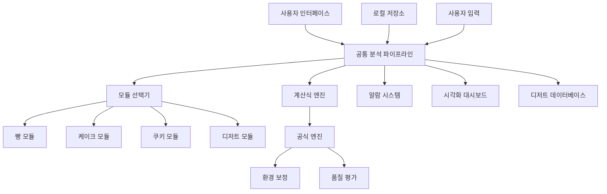

# 고도화된 수쉐프 시스템 설계 문서

## 개요

고도화된 수쉐프 시스템은 종합 제빵 과학 통합 계산식을 기반으로 한 과학적이고 정밀한 제과제빵 지원 시스템입니다. 기존의 단순한 레시피 계산기를 넘어서, 실시간 환경 모니터링, 각국 전통 디저트 데이터베이스, 품질 평가 시스템을 통합한 종합적인 제과제빵 솔루션을 제공합니다.

## 아키텍처

### 전체 시스템 아키텍처



### 계층별 구조

1. **프레젠테이션 계층**
   - 사용자 인터페이스 (Flutter UI)
   - 시각화 대시보드
   - 알람 시스템

2. **비즈니스 로직 계층**
   - 공통 분석 파이프라인
   - 모듈별 특화 계산 엔진
   - 환경 보정 시스템

3. **데이터 계층**
   - 각국 디저트 데이터베이스
   - 계산 결과 저장소
   - 사용자 설정 저장소

4. **외부 인터페이스 계층**
   - 로컬 알림 서비스
   - 향후 센서 연동 인터페이스 (확장 가능)

## 컴포넌트 및 인터페이스

### 1. 공통 분석 파이프라인 (CommonAnalysisPipeline)

```dart
class CommonAnalysisPipeline {
  // 레시피 입력 및 키워드 추출
  RecipeAnalysisResult analyzeRecipe(Recipe recipe);
  
  // 모듈 자동 선택
  BakingModule selectModule(List<String> keywords, List<Ingredient> ingredients);
  
  // 환경 정보 처리
  EnvironmentCorrection processEnvironment(EnvironmentalConditions conditions);
  
  // 재료 메타데이터 생성
  List<IngredientMetadata> generateIngredientMetadata(List<Ingredient> ingredients);
  
  // 공정 분석 및 가이드 생성
  ProcessGuide generateProcessGuide(Recipe recipe, BakingModule module);
}
```

### 2. 종합 제빵 과학 계산식 엔진 (BakingScienceFormulaEngine)

```dart
class BakingScienceFormulaEngine {
  // I. 기본 재료 비율 최적화
  MaterialRatioResult optimizeMaterialRatio(List<Ingredient> ingredients);
  
  // II. 반죽 물리화학적 상태 조정
  DoughPhysicalState calculateDoughState(MaterialRatioResult ratios);
  
  // III. 환경 및 지역 변수 보정
  EnvironmentCorrection calculateEnvironmentCorrection(EnvironmentalConditions conditions);
  
  // IV. 빵 종류별 특화 계산
  BreadSpecificResult calculateBreadSpecific(String breadType, DoughPhysicalState state);
  
  // V. 최적 공정 제어 및 시간 예측
  ProcessTimeResult predictProcessTime(Recipe recipe, EnvironmentalConditions conditions);
  
  // VI. 굽기 공정 최적화
  BakingOptimization optimizeBaking(Recipe recipe, OvenCharacteristics oven);
}
```

### 3. 모듈별 특화 시스템

#### 빵 모듈 (BreadModule)
```dart
class BreadModule extends BakingModule {
  // 도법 판정
  BreadMethod determineBreadMethod(List<String> keywords, List<Ingredient> ingredients);
  
  // 믹싱 가이드
  MixingGuide generateMixingGuide(Recipe recipe, EnvironmentalConditions conditions);
  
  // 발효 가이드
  FermentationGuide generateFermentationGuide(Recipe recipe, BreadMethod method);
  
  // 굽기 가이드
  BakingGuide generateBakingGuide(String breadType, DoughPhysicalState state);
}
```

#### 케이크 모듈 (CakeModule)
```dart
class CakeModule extends BakingModule {
  // 공정 모델 선택
  CakeProcessModel selectProcessModel(List<String> keywords);
  
  // 텍스처 예측
  TexturePrediction predictTexture(Recipe recipe, CakeProcessModel model);
  
  // 굽기 최적화
  CakeBakingGuide optimizeCakeBaking(Recipe recipe, OvenCharacteristics oven);
}
```

#### 쿠키 모듈 (CookieModule)
```dart
class CookieModule extends BakingModule {
  // 스프레드 예측
  SpreadPrediction predictSpread(Recipe recipe);
  
  // 굽기 최적화
  CookieBakingGuide optimizeCookieBaking(Recipe recipe, OvenCharacteristics oven);
}
```

#### 디저트 모듈 (DessertModule)
```dart
class DessertModule extends BakingModule {
  // 푸딩 계산
  PuddingCalculation calculatePudding(Recipe recipe);
  
  // 아이스크림 계산
  IceCreamCalculation calculateIceCream(Recipe recipe);
  
  // 젤리 계산
  JellyCalculation calculateJelly(Recipe recipe);
  
  // 사탕 계산
  CandyCalculation calculateCandy(Recipe recipe);
}
```

### 4. 각국 전통 디저트 데이터베이스 (TraditionalDessertDatabase)

```dart
class TraditionalDessertDatabase {
  // 디저트 정보 조회
  TraditionalDessert getDessert(String country, String dessertName);
  
  // 특화 계산식 적용
  DessertCalculationResult applySpecializedFormula(TraditionalDessert dessert, Recipe recipe);
  
  // 환경 보정 적용
  DessertCalculationResult applyEnvironmentCorrection(
    DessertCalculationResult result, 
    EnvironmentalConditions conditions
  );
}
```

### 5. 로컬 알람 시스템 (LocalAlertSystem)

```dart
class LocalAlertSystem {
  // 알람 조건 모니터링
  void monitorConditions(ProcessMonitoringData data);
  
  // 로컬 알림 전송
  Future<void> sendLocalNotification(AlertType type, String message, String action);
  
  // 알람 이력 관리
  void logAlert(Alert alert);
  
  // 타이머 기반 알람
  void scheduleTimerAlert(Duration duration, String message);
}
```

### 6. 시각화 대시보드 (VisualizationDashboard)

```dart
class VisualizationDashboard {
  // 볼륨 지수 시각화
  Widget buildVolumeIndexChart(List<VolumeData> data);
  
  // 크러스트 색상 지수 시각화
  Widget buildCrustColorChart(List<ColorData> data);
  
  // 기공 구조 점수 시각화
  Widget buildPoreStructureHistogram(List<PoreData> data);
  
  // 환경 변수 모니터링
  Widget buildEnvironmentMonitor(EnvironmentalConditions conditions);
}
```

## 데이터 모델

### 1. 핵심 데이터 구조

```dart
class AdvancedRecipeData {
  Recipe recipe;
  EnvironmentalConditions environment;
  List<IngredientMetadata> ingredientMeta;
  ProcessMetadata processMeta;
  QualityMetadata qualityMeta;
  DessertMetadata? dessertMeta;
  InterfaceMetadata interfaceMeta;
}

class Recipe {
  String title;
  List<Ingredient> ingredients;
  List<String> processes;
  String category; // bread, cake, cookie, dessert
}

class EnvironmentalConditions {
  double temperature;
  double humidity;
  double pressure;
  String season;
  OvenCharacteristics oven;
}

class IngredientMetadata {
  String name;
  Map<String, dynamic> properties; // 글루텐, 수분, 단백질 등
  double effectiveValue;
  String function;
}

class ProcessMetadata {
  MixingMeta mixing;
  FermentationMeta fermentation;
  BakingMeta baking;
}

class QualityMetadata {
  double volumeIndex;
  double crustColorIndex;
  double poreStructureScore;
  double moistureRetention;
}
```

### 2. 각국 전통 디저트 데이터 구조

```dart
class TraditionalDessert {
  String name;
  String country;
  List<Ingredient> ingredients;
  List<ProcessStep> processes;
  Map<String, String> calculationFormulas;
  EnvironmentCorrection environmentCorrection;
  List<String> references;
}

class DessertCalculationResult {
  String dessertType;
  Map<String, double> calculatedValues;
  Map<String, double> correctionFactors;
  QualityPrediction qualityPrediction;
}
```

### 3. 알람 및 대시보드 데이터 구조

```dart
class Alert {
  AlertType type;
  String message;
  String action;
  DateTime timestamp;
  AlertSeverity severity;
}

class DashboardData {
  VolumeIndexData volumeIndex;
  CrustColorData crustColor;
  PoreStructureData poreStructure;
  EnvironmentData environment;
  List<Alert> recentAlerts;
}
```

## 에러 처리

### 1. 계산식 에러 처리

```dart
class FormulaCalculationException implements Exception {
  final String formula;
  final String error;
  final Map<String, dynamic> inputData;
  
  FormulaCalculationException(this.formula, this.error, this.inputData);
}
```

### 2. 센서 연동 에러 처리

```dart
class SensorConnectionException implements Exception {
  final String sensorType;
  final String connectionError;
  
  SensorConnectionException(this.sensorType, this.connectionError);
}
```

### 3. 데이터베이스 에러 처리

```dart
class DessertDatabaseException implements Exception {
  final String country;
  final String dessertName;
  final String error;
  
  DessertDatabaseException(this.country, this.dessertName, this.error);
}
```

## 테스팅 전략

### 1. 단위 테스트
- 각 계산식의 정확성 검증
- 환경 보정 계수 테스트
- 모듈별 특화 계산 테스트

### 2. 통합 테스트
- 공통 분석 파이프라인 전체 플로우 테스트
- 알람 시스템과 대시보드 연동 테스트
- 센서 인터페이스 연동 테스트

### 3. 성능 테스트
- 복잡한 계산식의 실행 시간 측정
- 대용량 디저트 데이터베이스 조회 성능
- 실시간 모니터링 시스템 부하 테스트

### 4. 사용자 테스트
- 실제 제과제빵사와의 정확성 검증
- 알람 시스템의 유용성 평가
- 대시보드 UI/UX 테스트

## 보안 고려사항

### 1. 온디바이스 데이터 보호
- 사용자 레시피 데이터 로컬 암호화
- 개인 설정 정보 보안 저장
- 외부 네트워크 통신 없음으로 데이터 유출 방지

### 2. 로컬 저장소 보안
- SQLite 데이터베이스 암호화
- 앱 샌드박스 내 데이터 격리
- 디바이스 잠금 시 데이터 접근 제한

## 성능 최적화

### 1. 계산 최적화
- 복잡한 공식의 캐싱
- 병렬 계산 처리
- 메모리 효율적인 데이터 구조

### 2. UI 최적화
- 실시간 차트 렌더링 최적화
- 대시보드 데이터 업데이트 최적화
- 알람 시스템 반응성 개선

### 3. 데이터베이스 최적화
- 디저트 데이터 인덱싱
- 계산 결과 캐싱
- 효율적인 쿼리 최적화

## 확장성 고려사항

### 1. 새로운 디저트 추가
- 플러그인 형태의 디저트 모듈
- 동적 계산식 로딩
- 다국어 지원 확장

### 2. 향후 센서 확장 (조건부)
- 표준화된 센서 프로토콜 지원 준비
- 특정 업체 의뢰 시 맞춤형 센서 연동
- 온디바이스 센서 데이터 처리

### 3. 계산식 확장
- 새로운 과학적 공식 추가
- 사용자 정의 계산식
- 머신러닝 기반 예측 모델

이 설계는 문서에서 제시된 모든 요구사항을 충족하면서도 확장 가능하고 유지보수가 용이한 구조로 설계되었습니다.