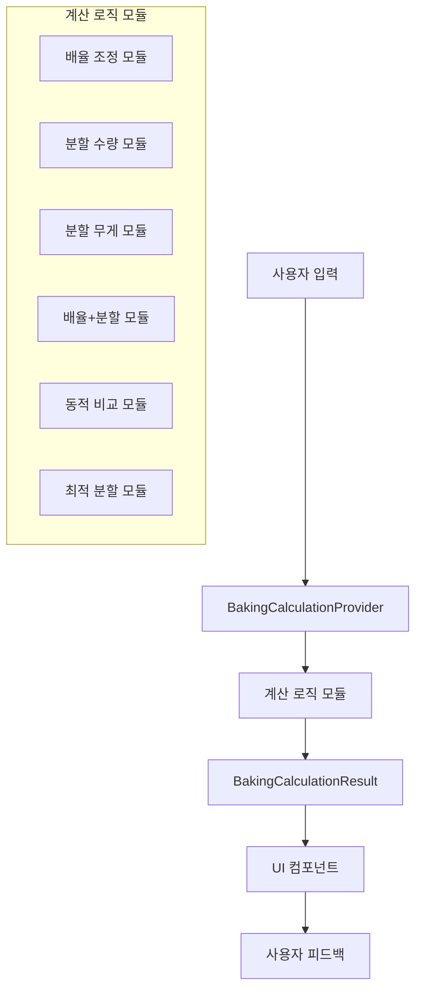
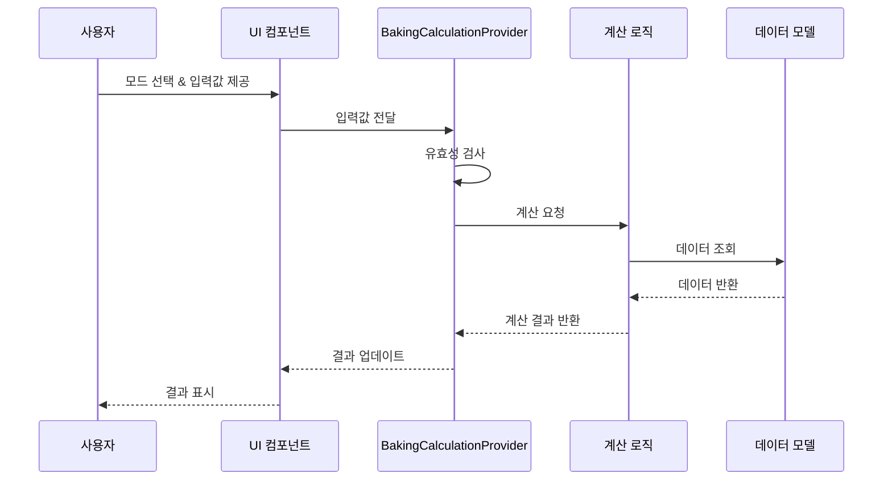

# 베이킹 계산기 개선 설계

## 개요

이 문서는 베이킹 계산기 개선을 위한 설계 방안을 설명합니다. 현재 베이킹 모드 계산기는 일부 기능이 의도대로 작동하지 않고, 계산 로직이 물리적/논리적 한계를 벗어나는 경우가 있습니다. 이 설계는 이러한 문제를 해결하고 사용자 경험을 향상시키기 위한 방안을 제시합니다.

## 아키텍처

### 전체 아키텍처

베이킹 계산기 개선을 위해 다음과 같은 아키텍처를 적용합니다:

1. **로직 분리**: 베이킹 모드와 일반 레시피 계산 로직을 분리
2. **모델-뷰-프로바이더 패턴**: 데이터 모델, UI 컴포넌트, 상태 관리를 명확히 분리
3. **모듈화**: 각 계산 모드를 독립적인 모듈로 구현하여 유지보수성 향상



### 데이터 흐름



## 컴포넌트 및 인터페이스

### 1. 데이터 모델

#### 1.1 BakingCalculationMode 열거형

```dart
enum BakingCalculationMode {
  scaleAdjustment,      // 배율 조정
  splitByCount,         // 분할 수량 기준
  splitByWeight,        // 분할 무게 기준
  scaleAndSplit,        // 배율 조정 후 분할
  dynamicComparison,    // 동적 비교
  optimalSplit,         // 최적 분할
}
```

#### 1.2 BakingCalculationResult 클래스

```dart
class BakingCalculationResult {
  final double totalWeight;           // 총 재료 무게
  final double splitWeight;           // 각 분할 무게
  final int splitCount;               // 분할 개수
  final double remainingWeight;       // 남은 재료 무게
  final double scale;                 // 적용된 배율
  final List<Map<String, dynamic>> originalIngredients;    // 원본 재료
  final List<Map<String, dynamic>> calculatedIngredients;  // 계산된 재료
  final bool isOptimized;             // 최적화 여부
  
  BakingCalculationResult({
    required this.totalWeight,
    required this.splitWeight,
    required this.splitCount,
    required this.remainingWeight,
    required this.scale,
    required this.originalIngredients,
    required this.calculatedIngredients,
    this.isOptimized = false,
  });
}
```

### 2. 상태 관리

#### 2.1 BakingCalculationProvider 클래스

```dart
class BakingCalculationProvider extends ChangeNotifier {
  // 상태 변수
  Recipe? _recipe;
  BakingCalculationMode _mode = BakingCalculationMode.scaleAdjustment;
  double _scale = 1.0;
  int _splitCount = 1;
  double _splitWeight = 0.0;
  bool _optimizeSplit = false;
  
  // 계산 결과
  BakingCalculationResult? _result;
  
  // Getter/Setter
  Recipe? get recipe => _recipe;
  BakingCalculationMode get mode => _mode;
  double get scale => _scale;
  int get splitCount => _splitCount;
  double get splitWeight => _splitWeight;
  bool get optimizeSplit => _optimizeSplit;
  BakingCalculationResult? get result => _result;
  
  // 메서드
  void setRecipe(Recipe recipe) { ... }
  void setMode(BakingCalculationMode mode) { ... }
  void setScale(double scale) { ... }
  void setSplitCount(int count) { ... }
  void setSplitWeight(double weight) { ... }
  void toggleOptimizeSplit() { ... }
  void _resetCalculation() { ... }
  void _calculate() { ... }
  
  // 모드별 계산 메서드
  void _calculateScaleAdjustment() { ... }
  void _calculateSplitByCount() { ... }
  void _calculateSplitByWeight() { ... }
  void _calculateScaleAndSplit() { ... }
  void _calculateDynamicComparison() { ... }
  void _calculateOptimalSplit() { ... }
}
```

### 3. UI 컴포넌트

#### 3.1 BakingCalculator 위젯

```dart
class BakingCalculator extends StatelessWidget {
  final Recipe recipe;
  final String unitSystem;
  
  const BakingCalculator({
    Key? key,
    required this.recipe,
    required this.unitSystem,
  }) : super(key: key);
  
  @override
  Widget build(BuildContext context) { ... }
  
  // 모드 선택 탭 위젯
  Widget _buildModeSelector(BuildContext context, BakingCalculationProvider provider) { ... }
  
  // 모드별 입력 컨트롤 위젯
  Widget _buildInputControls(BuildContext context, BakingCalculationProvider provider) { ... }
  
  // 결과 표시 위젯
  Widget _buildResultDisplay(BuildContext context, BakingCalculationProvider provider) { ... }
  
  // 비교 행 위젯
  Widget _buildComparisonRow({...}) { ... }
}
```

## 계산 로직

### 1. 배율 조정 모드

배율 조정 모드는 원본 레시피의 모든 재료량을 입력된 배율에 맞게 조정합니다.

```dart
void _calculateScaleAdjustment() {
  if (_recipe == null) return;
  
  final originalIngredients = _recipe!.ingredients;
  final calculatedIngredients = originalIngredients.map((ingredient) {
    final originalAmount = ingredient['amount'] as double;
    final calculatedAmount = originalAmount * _scale;
    
    return {
      ...ingredient,
      'amount': calculatedAmount,
    };
  }).toList();
  
  final totalWeight = _recipe!.totalIngredientWeight ?? 0.0;
  final calculatedTotalWeight = totalWeight * _scale;
  
  _result = BakingCalculationResult(
    totalWeight: calculatedTotalWeight,
    splitWeight: calculatedTotalWeight,
    splitCount: 1,
    remainingWeight: 0.0,
    scale: _scale,
    originalIngredients: originalIngredients,
    calculatedIngredients: calculatedIngredients,
  );
}
```

### 2. 분할 수량 기준 모드

분할 수량 기준 모드는 원본 레시피를 입력된 분할 수량에 맞게 분할합니다.

```dart
void _calculateSplitByCount() {
  if (_recipe == null) return;
  
  final totalWeight = _recipe!.totalIngredientWeight ?? 0.0;
  final splitWeight = totalWeight / _splitCount;
  final remainingWeight = totalWeight - (splitWeight * _splitCount);
  
  final originalIngredients = _recipe!.ingredients;
  final calculatedIngredients = originalIngredients.map((ingredient) {
    final originalAmount = ingredient['amount'] as double;
    final calculatedAmount = originalAmount / _splitCount;
    
    return {
      ...ingredient,
      'amount': calculatedAmount,
    };
  }).toList();
  
  _result = BakingCalculationResult(
    totalWeight: totalWeight,
    splitWeight: splitWeight,
    splitCount: _splitCount,
    remainingWeight: remainingWeight,
    scale: 1.0,
    originalIngredients: originalIngredients,
    calculatedIngredients: calculatedIngredients,
  );
}
```

### 3. 분할 무게 기준 모드

분할 무게 기준 모드는 원본 레시피를 입력된 분할 무게에 맞게 분할합니다.

```dart
void _calculateSplitByWeight() {
  if (_recipe == null) return;
  
  final totalWeight = _recipe!.totalIngredientWeight ?? 0.0;
  final splitCount = (totalWeight / _splitWeight).floor();
  final remainingWeight = totalWeight - (splitWeight * splitCount);
  
  final originalIngredients = _recipe!.ingredients;
  final calculatedIngredients = originalIngredients.map((ingredient) {
    final originalAmount = ingredient['amount'] as double;
    final ratio = _splitWeight / totalWeight;
    final calculatedAmount = originalAmount * ratio;
    
    return {
      ...ingredient,
      'amount': calculatedAmount,
    };
  }).toList();
  
  _result = BakingCalculationResult(
    totalWeight: totalWeight,
    splitWeight: _splitWeight,
    splitCount: splitCount,
    remainingWeight: remainingWeight,
    scale: 1.0,
    originalIngredients: originalIngredients,
    calculatedIngredients: calculatedIngredients,
  );
}
```

### 4. 배율 조정 후 분할 모드

배율 조정 후 분할 모드는 배율 조정된 레시피에 분할량/분할 수를 적용합니다.

```dart
void _calculateScaleAndSplit() {
  if (_recipe == null) return;
  
  final totalWeight = (_recipe!.totalIngredientWeight ?? 0.0) * _scale;
  final splitWeight = totalWeight / _splitCount;
  final remainingWeight = totalWeight - (splitWeight * _splitCount);
  
  final originalIngredients = _recipe!.ingredients;
  final calculatedIngredients = originalIngredients.map((ingredient) {
    final originalAmount = ingredient['amount'] as double;
    final scaledAmount = originalAmount * _scale;
    final calculatedAmount = scaledAmount / _splitCount;
    
    return {
      ...ingredient,
      'amount': calculatedAmount,
    };
  }).toList();
  
  _result = BakingCalculationResult(
    totalWeight: totalWeight,
    splitWeight: splitWeight,
    splitCount: _splitCount,
    remainingWeight: remainingWeight,
    scale: _scale,
    originalIngredients: originalIngredients,
    calculatedIngredients: calculatedIngredients,
  );
}
```

### 5. 동적 비교 모드

동적 비교 모드는 입력값에 따라 원본 대비 증감을 자동 계산합니다.

```dart
void _calculateDynamicComparison() {
  if (_recipe == null) return;
  
  final originalTotalWeight = _recipe!.totalIngredientWeight ?? 0.0;
  final calculatedTotalWeight = _splitWeight * _splitCount;
  final scale = calculatedTotalWeight / originalTotalWeight;
  final remainingWeight = 0.0; // 동적 비교 모드에서는 남은 재료가 없음
  
  final originalIngredients = _recipe!.ingredients;
  final calculatedIngredients = originalIngredients.map((ingredient) {
    final originalAmount = ingredient['amount'] as double;
    final calculatedAmount = originalAmount * scale;
    
    return {
      ...ingredient,
      'amount': calculatedAmount,
    };
  }).toList();
  
  _result = BakingCalculationResult(
    totalWeight: calculatedTotalWeight,
    splitWeight: _splitWeight,
    splitCount: _splitCount,
    remainingWeight: remainingWeight,
    scale: scale,
    originalIngredients: originalIngredients,
    calculatedIngredients: calculatedIngredients,
  );
}
```

### 6. 최적 분할 모드

최적 분할 모드는 재료가 남지 않도록 최적 분할을 계산합니다.

```dart
void _calculateOptimalSplit() {
  if (_recipe == null) return;
  
  final totalWeight = _recipe!.totalIngredientWeight ?? 0.0;
  
  // 분할 무게 기준 최적화
  if (_mode == BakingCalculationMode.splitByWeight) {
    final optimalSplitCount = (totalWeight / _splitWeight).round();
    final optimalSplitWeight = totalWeight / optimalSplitCount;
    
    final originalIngredients = _recipe!.ingredients;
    final calculatedIngredients = originalIngredients.map((ingredient) {
      final originalAmount = ingredient['amount'] as double;
      final ratio = optimalSplitWeight / totalWeight;
      final calculatedAmount = originalAmount * ratio;
      
      return {
        ...ingredient,
        'amount': calculatedAmount,
      };
    }).toList();
    
    _result = BakingCalculationResult(
      totalWeight: totalWeight,
      splitWeight: optimalSplitWeight,
      splitCount: optimalSplitCount,
      remainingWeight: 0.0,
      scale: 1.0,
      originalIngredients: originalIngredients,
      calculatedIngredients: calculatedIngredients,
      isOptimized: true,
    );
  }
  
  // 분할 수량 기준 최적화
  else if (_mode == BakingCalculationMode.splitByCount) {
    final optimalSplitWeight = totalWeight / _splitCount;
    
    final originalIngredients = _recipe!.ingredients;
    final calculatedIngredients = originalIngredients.map((ingredient) {
      final originalAmount = ingredient['amount'] as double;
      final calculatedAmount = originalAmount / _splitCount;
      
      return {
        ...ingredient,
        'amount': calculatedAmount,
      };
    }).toList();
    
    _result = BakingCalculationResult(
      totalWeight: totalWeight,
      splitWeight: optimalSplitWeight,
      splitCount: _splitCount,
      remainingWeight: 0.0,
      scale: 1.0,
      originalIngredients: originalIngredients,
      calculatedIngredients: calculatedIngredients,
      isOptimized: true,
    );
  }
}
```

## 유효성 검사

### 1. 배율 유효성 검사

```dart
void setScale(double scale) {
  if (scale <= 0) {
    scale = 0.1; // 최소값 설정
    _showValidationMessage('배율은 0보다 커야 합니다. 최소값 0.1로 조정되었습니다.');
  } else if (scale > 10.0) {
    scale = 10.0; // 최대값 설정
    _showValidationMessage('배율이 너무 큽니다. 최대값 10.0으로 조정되었습니다.');
  }
  
  _scale = scale;
  _calculate();
  notifyListeners();
}
```

### 2. 분할 수량 유효성 검사

```dart
void setSplitCount(int count) {
  if (count < 1) {
    count = 1; // 최소값 설정
    _showValidationMessage('분할 수량은 최소 1개 이상이어야 합니다.');
  } else if (count > 100) {
    count = 100; // 최대값 설정
    _showValidationMessage('분할 수량이 너무 많습니다. 최대 100개로 조정되었습니다.');
  }
  
  _splitCount = count;
  _calculate();
  notifyListeners();
}
```

### 3. 분할 무게 유효성 검사

```dart
void setSplitWeight(double weight) {
  if (_recipe == null) return;
  
  double totalWeight = _recipe!.totalIngredientWeight ?? 0.0;
  
  if (weight <= 0) {
    weight = 10.0; // 최소값 설정
    _showValidationMessage('분할 무게는 0보다 커야 합니다. 최소값 10g로 조정되었습니다.');
  } else if (weight > totalWeight * _scale) {
    weight = totalWeight * _scale; // 최대값 설정
    _showValidationMessage('분할 무게가 총 재료 무게를 초과합니다. 최대값으로 조정되었습니다.');
  }
  
  _splitWeight = weight;
  _calculate();
  notifyListeners();
}
```

## UI 설계

### 1. 모드 선택 탭

```dart
Widget _buildModeSelector(BuildContext context, BakingCalculationProvider provider) {
  return SingleChildScrollView(
    scrollDirection: Axis.horizontal,
    child: SegmentedButton<BakingCalculationMode>(
      segments: [
        ButtonSegment(
          value: BakingCalculationMode.scaleAdjustment,
          label: Text('배율 조정'),
          icon: Icon(Icons.scale),
        ),
        ButtonSegment(
          value: BakingCalculationMode.splitByCount,
          label: Text('분할 수량'),
          icon: Icon(Icons.format_list_numbered),
        ),
        ButtonSegment(
          value: BakingCalculationMode.splitByWeight,
          label: Text('분할 무게'),
          icon: Icon(Icons.line_weight),
        ),
        ButtonSegment(
          value: BakingCalculationMode.scaleAndSplit,
          label: Text('배율+분할'),
          icon: Icon(Icons.calculate),
        ),
        ButtonSegment(
          value: BakingCalculationMode.dynamicComparison,
          label: Text('동적 비교'),
          icon: Icon(Icons.compare_arrows),
        ),
        ButtonSegment(
          value: BakingCalculationMode.optimalSplit,
          label: Text('최적 분할'),
          icon: Icon(Icons.auto_fix_high),
        ),
      ],
      selected: {provider.mode},
      onSelectionChanged: (Set<BakingCalculationMode> selection) {
        provider.setMode(selection.first);
      },
    ),
  );
}
```

### 2. 입력 컨트롤

```dart
Widget _buildScaleAdjustmentControls(BuildContext context, BakingCalculationProvider provider) {
  return Column(
    children: [
      Text('배율 조정', style: Theme.of(context).textTheme.titleMedium),
      Row(
        children: [
          Expanded(
            child: Slider(
              value: provider.scale,
              min: 0.1,
              max: 10.0,
              divisions: 99,
              label: provider.scale.toStringAsFixed(1),
              onChanged: (value) => provider.setScale(value),
            ),
          ),
          SizedBox(width: 8),
          SizedBox(
            width: 60,
            child: TextFormField(
              initialValue: provider.scale.toStringAsFixed(1),
              keyboardType: TextInputType.number,
              decoration: InputDecoration(
                suffixText: 'x',
                contentPadding: EdgeInsets.symmetric(horizontal: 8, vertical: 0),
              ),
              onChanged: (value) {
                if (value.isNotEmpty) {
                  provider.setScale(double.tryParse(value) ?? 1.0);
                }
              },
            ),
          ),
        ],
      ),
      Tooltip(
        message: '원본 레시피의 모든 재료량을 배율에 맞게 조정합니다.',
        child: Row(
          children: [
            Icon(Icons.info_outline, size: 16, color: Colors.blue),
            SizedBox(width: 4),
            Text('배율을 조정하여 전체 레시피 양을 변경합니다.', 
              style: TextStyle(fontSize: 12, color: Colors.grey[600])),
          ],
        ),
      ),
    ],
  );
}
```

### 3. 결과 표시

```dart
Widget _buildResultDisplay(BuildContext context, BakingCalculationProvider provider) {
  final result = provider.result;
  if (result == null) return SizedBox.shrink();
  
  return Card(
    margin: EdgeInsets.symmetric(vertical: 8.0),
    elevation: 3.0,
    shape: RoundedRectangleBorder(borderRadius: BorderRadius.circular(10.0)),
    child: Padding(
      padding: const EdgeInsets.all(12.0),
      child: Column(
        crossAxisAlignment: CrossAxisAlignment.start,
        children: [
          Text('계산 결과', 
            style: Theme.of(context).textTheme.titleMedium?.copyWith(
              color: Colors.brown[700],
              fontWeight: FontWeight.bold
            )
          ),
          Divider(),
          _buildComparisonRow(
            label: '총 재료 무게',
            originalValue: recipe.totalIngredientWeight ?? 0.0,
            calculatedValue: result.totalWeight,
            unit: UnitConverter.getUnits(unitSystem).first,
          ),
          if (provider.mode == BakingCalculationMode.splitByCount || 
              provider.mode == BakingCalculationMode.splitByWeight ||
              provider.mode == BakingCalculationMode.scaleAndSplit ||
              provider.mode == BakingCalculationMode.optimalSplit) ...[
            _buildComparisonRow(
              label: '분할 수량',
              originalValue: recipe.targetSplitCount?.toDouble() ?? 0.0,
              calculatedValue: result.splitCount.toDouble(),
              unit: '개',
            ),
            _buildComparisonRow(
              label: '각 분할 무게',
              originalValue: recipe.targetSplitAmount ?? 0.0,
              calculatedValue: result.splitWeight,
              unit: UnitConverter.getUnits(unitSystem).first,
            ),
            _buildComparisonRow(
              label: '남은 재료 무게',
              originalValue: recipe.calculatedRemainingWeight ?? 0.0,
              calculatedValue: result.remainingWeight,
              unit: UnitConverter.getUnits(unitSystem).first,
            ),
          ],
          if (provider.optimizeSplit && result.isOptimized)
            Container(
              margin: EdgeInsets.only(top: 8),
              padding: EdgeInsets.all(8),
              decoration: BoxDecoration(
                color: Colors.green[50],
                borderRadius: BorderRadius.circular(8),
                border: Border.all(color: Colors.green[300]!),
              ),
              child: Row(
                children: [
                  Icon(Icons.check_circle, color: Colors.green),
                  SizedBox(width: 8),
                  Text('최적 분할 적용됨', style: TextStyle(color: Colors.green[700])),
                ],
              ),
            ),
        ],
      ),
    ),
  );
}
```

## 오류 처리

### 1. 유효성 검사 메시지 표시

```dart
void _showValidationMessage(String message) {
  // SnackBar 또는 다른 방식으로 메시지 표시
  // 이 메서드는 Provider 내부에서 호출되므로 BuildContext가 없음
  // 따라서 메시지를 상태로 저장하고 UI에서 표시하는 방식 사용
  _validationMessage = message;
  _hasValidationError = true;
  
  // 일정 시간 후 메시지 초기화
  Future.delayed(Duration(seconds: 3), () {
    _validationMessage = null;
    _hasValidationError = false;
    notifyListeners();
  });
}
```

### 2. UI에서 오류 표시

```dart
Widget _buildValidationMessage(BuildContext context, BakingCalculationProvider provider) {
  if (!provider.hasValidationError || provider.validationMessage == null) {
    return SizedBox.shrink();
  }
  
  return Container(
    margin: EdgeInsets.only(top: 8),
    padding: EdgeInsets.all(8),
    decoration: BoxDecoration(
      color: Colors.amber[50],
      borderRadius: BorderRadius.circular(8),
      border: Border.all(color: Colors.amber[300]!),
    ),
    child: Row(
      children: [
        Icon(Icons.warning_amber_rounded, color: Colors.amber),
        SizedBox(width: 8),
        Expanded(
          child: Text(
            provider.validationMessage!,
            style: TextStyle(color: Colors.amber[900]),
          ),
        ),
      ],
    ),
  );
}
```

## 테스트 전략

### 1. 단위 테스트

각 계산 모드의 로직을 독립적으로 테스트합니다.

```dart
void main() {
  group('BakingCalculationProvider Tests', () {
    late BakingCalculationProvider provider;
    late Recipe testRecipe;
    
    setUp(() {
      provider = BakingCalculationProvider();
      testRecipe = Recipe(
        id: 1,
        title: 'Test Recipe',
        ingredients: [
          {'name': 'Flour', 'amount': 100.0, 'unit': 'g'},
          {'name': 'Sugar', 'amount': 50.0, 'unit': 'g'},
        ],
        instructions: [],
        totalIngredientWeight: 150.0,
      );
      provider.setRecipe(testRecipe);
    });
    
    test('should calculate scale adjustment correctly', () {
      provider.setMode(BakingCalculationMode.scaleAdjustment);
      provider.setScale(2.0);
      
      final result = provider.result;
      expect(result, isNotNull);
      expect(result!.totalWeight, 300.0);
      expect(result.calculatedIngredients[0]['amount'], 200.0);
      expect(result.calculatedIngredients[1]['amount'], 100.0);
    });
    
    // 다른 모드에 대한 테스트...
  });
}
```

### 2. 위젯 테스트

UI 컴포넌트의 동작을 테스트합니다.

```dart
void main() {
  testWidgets('BakingCalculator displays correct values', (WidgetTester tester) async {
    final recipe = Recipe(
      id: 1,
      title: 'Test Recipe',
      ingredients: [
        {'name': 'Flour', 'amount': 100.0, 'unit': 'g'},
        {'name': 'Sugar', 'amount': 50.0, 'unit': 'g'},
      ],
      instructions: [],
      totalIngredientWeight: 150.0,
      targetSplitAmount: 50.0,
      targetSplitCount: 3,
    );
    
    final calculationProvider = BakingCalculationProvider();
    calculationProvider.setRecipe(recipe);
    
    await tester.pumpWidget(
      MaterialApp(
        home: Scaffold(
          body: ChangeNotifierProvider<BakingCalculationProvider>.value(
            value: calculationProvider,
            child: BakingCalculator(
              recipe: recipe,
              unitSystem: 'metric',
            ),
          ),
        ),
      ),
    );
    
    // UI 요소 확인
    expect(find.text('배율 조정'), findsOneWidget);
    
    // 모드 변경 테스트
    await tester.tap(find.text('분할 수량'));
    await tester.pumpAndSettle();
    
    // 입력값 변경 테스트
    await tester.enterText(find.byType(TextFormField).first, '4');
    await tester.testTextInput.receiveAction(TextInputAction.done);
    await tester.pumpAndSettle();
    
    // 결과 확인
    expect(find.text('분할 수량'), findsWidgets);
    expect(find.text('4개'), findsOneWidget);
  });
}
```

## 결론

이 설계는 베이킹 계산기의 기능을 크게 개선하고, 사용자 경험을 향상시키며, 계산의 정확성과 유연성을 높일 것입니다. 특히 다양한 계산 모드와 강화된 유효성 검사를 통해 사용자가 자신의 필요에 맞게 레시피를 조정할 수 있게 됩니다.