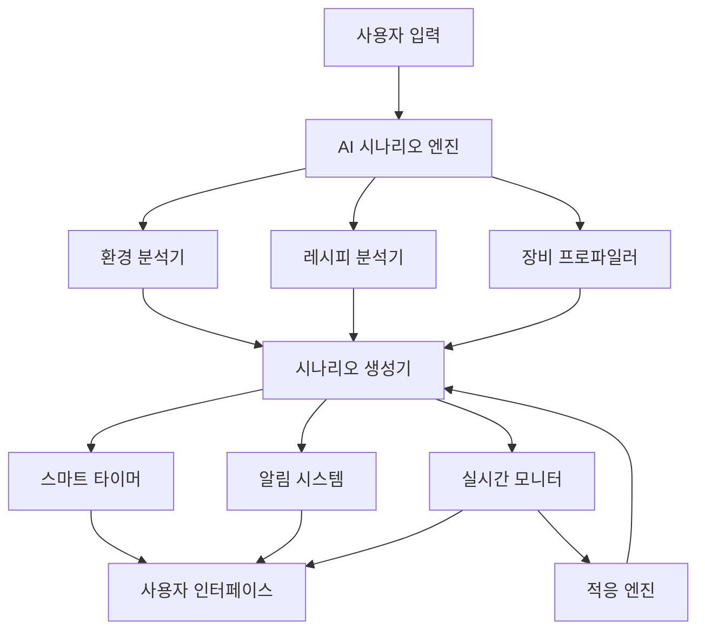

# 발효 시나리오 시스템 설계

## 개요

발효 시나리오 시스템은 기존의 "사용자가 계산하는 방식"에서 "AI가 모든 것을 계산하고 사용자는 따라만 하는 방식"으로의 패러다임 전환을 구현합니다. 시스템은 환경 조건, 레시피 특성, 장비 정보를 종합 분석하여 완벽한 발효 시나리오를 자동 생성하고, 타이머 연동을 통해 전 과정을 자동화합니다.

## 아키텍처

### 전체 시스템 구조

```
┌─────────────────────────────────────────────────────────────┐
│                    Fermentation Scenario System             │
├─────────────────────────────────────────────────────────────┤
│  UI Layer                                                   │
│  ├── Scenario Selection Interface                           │
│  ├── Real-time Progress Dashboard                           │
│  └── Notification & Alert System                            │
├─────────────────────────────────────────────────────────────┤
│  Business Logic Layer                                       │
│  ├── AI Scenario Engine                                     │
│  ├── Smart Timer Controller                                 │
│  ├── Real-time Adaptation Engine                            │
│  └── Equipment Integration Manager                          │
├─────────────────────────────────────────────────────────────┤
│  Data Layer                                                 │
│  ├── Recipe Analysis Database                               │
│  ├── Environmental Conditions Store                         │
│  ├── Equipment Profiles Repository                          │
│  └── Scenario Templates Library                             │
└─────────────────────────────────────────────────────────────┘
```

### 핵심 컴포넌트 관계도



## 컴포넌트 및 인터페이스

### 1. AI 시나리오 엔진 (FermentationScenarioEngine)

**핵심 책임**: 모든 입력 조건을 분석하여 완벽한 발효 시나리오 생성

```dart
class FermentationScenarioEngine {
  // 메인 시나리오 생성 메서드
  Future<FermentationScenario> generateScenario({
    required FermentationMode mode,           // 실온 vs 발효기
    required FermentationMethod method,       // 일반/저온/냉동
    required RecipeAnalysis recipe,           // 레시피 분석 결과
    required EnvironmentalConditions env,     // 현재 환경
    required EquipmentProfile equipment,      // 사용 장비
  });
  
  // 실시간 시나리오 재계산
  Future<FermentationScenario> adaptScenario(
    FermentationScenario current,
    EnvironmentalChange change,
  );
}
```

**시나리오 생성 로직**:
1. **레시피 특성 분석**: 강력분 비율, 설탕 함량, 이스트 종류/양 분석
2. **환경 조건 평가**: 현재 온도, 습도, 계절적 요인 고려
3. **장비 성능 반영**: 발효기 정확도, 냉장고 온도 안정성 등
4. **최적 타이밍 계산**: 각 단계별 정확한 시간과 조건 산출
5. **예외 상황 대비**: 환경 변화 시 대응 방안 사전 준비

### 2. 스마트 타이머 컨트롤러 (SmartFermentationTimer)

**핵심 책임**: 시나리오의 모든 단계를 자동으로 관리하고 제어

```dart
class SmartFermentationTimer {
  // 시나리오 기반 타이머 시작
  Future<void> startScenario(FermentationScenario scenario);
  
  // 단계별 자동 전환
  Future<void> advanceToNextStage();
  
  // 실시간 시간 조정
  Future<void> adjustTiming(Duration adjustment, String reason);
  
  // 긴급 상황 처리
  Future<void> handleEmergency(EmergencyType type);
}
```

**타이머 관리 기능**:
- **다중 타이머 동시 관리**: 1차 발효, 휴지, 최종 발효 등
- **스마트 알림**: 단계별 맞춤 알림 및 행동 지침
- **자동 조정**: 환경 변화에 따른 실시간 시간 재계산
- **백그라운드 동작**: 앱 종료 시에도 알림 지속

### 3. 실시간 적응 엔진 (RealTimeAdaptationEngine)

**핵심 책임**: 환경 변화를 감지하고 시나리오를 실시간으로 조정

```dart
class RealTimeAdaptationEngine {
  // 환경 변화 감지
  Stream<EnvironmentalChange> monitorEnvironment();
  
  // 발효 상태 예측
  Future<FermentationState> predictFermentationState(
    FermentationScenario scenario,
    Duration elapsed,
    EnvironmentalConditions current,
  );
  
  // 자동 조정 실행
  Future<ScenarioAdjustment> calculateAdjustment(
    FermentationState predicted,
    FermentationState target,
  );
}
```

### 4. 발효기 설정 가이드 관리자 (FermenterGuideManager)

**핵심 책임**: 발효기 사용자에게 최적 설정값과 설정 방법 안내

```dart
class FermenterGuideManager {
  // 발효기 최적 설정값 계산
  Future<FermenterSettings> calculateOptimalSettings(
    FermentationStage stage,
    RecipeAnalysis recipe,
  );
  
  // 발효기 설정 가이드 생성
  Future<List<SettingInstruction>> generateSettingInstructions(
    FermenterSettings settings,
    FermenterType fermenterType,
  );
  
  // 오버나이트/냉동 안전 설정 계산
  Future<SafeStorageSettings> calculateSafeStorageSettings(
    StorageType type,
    Duration duration,
    RecipeAnalysis recipe,
  );
}
```

## 데이터 모델

### 핵심 데이터 구조

```dart
// 완전한 발효 시나리오
class FermentationScenario {
  final String id;
  final FermentationMode mode;
  final FermentationMethod method;
  final List<FermentationStage> stages;
  final Map<String, dynamic> metadata;
  final DateTime createdAt;
  final Duration totalDuration;
}

// 발효 단계 정의
class FermentationStage {
  final String name;
  final FermentationStageType type;
  final Duration duration;
  final TemperatureRange temperature;
  final HumidityRange humidity;
  final List<UserInstruction> instructions;
  final List<AutomationAction> automations;
  final AlertSettings alerts;
}

// 사용자 행동 지침
class UserInstruction {
  final String action;
  final String description;
  final Duration timing;
  final InstructionPriority priority;
  final List<String> visualAids;
}

// 자동화 액션
class AutomationAction {
  final AutomationTarget target;
  final Map<String, dynamic> settings;
  final Duration executeAt;
  final List<String> conditions;
}
```

### 시나리오 템플릿 구조

```dart
// 실온 발효 시나리오 템플릿
class RoomTemperatureFermentationTemplate {
  // 일반 실온 발효
  static FermentationScenario normalRoomFermentation({
    required RecipeAnalysis recipe,
    required EnvironmentalConditions env,
  });
  
  // 냉장 저온 발효
  static FermentationScenario coldRetardation({
    required RecipeAnalysis recipe,
    required RefrigeratorProfile fridge,
    required DateTime targetBakeTime,
  });
  
  // 냉동 오버나이트
  static FermentationScenario freezerOvernight({
    required RecipeAnalysis recipe,
    required FreezerProfile freezer,
    required DateTime plannedUseDate,
  });
}

// 발효기 가이드 템플릿
class FermenterGuideTemplate {
  // 발효기 설정 가이드 시나리오
  static FermentationScenario fermenterGuide({
    required RecipeAnalysis recipe,
    required FermenterProfile fermenter,
  });
  
  // 오버나이트 발효기 설정 가이드
  static FermentationScenario overnightFermenterGuide({
    required RecipeAnalysis recipe,
    required FermenterProfile fermenter,
    required Duration overnightDuration,
  });
  
  // 냉동 보관 후 발효기 사용 가이드
  static FermentationScenario frozenToFermenterGuide({
    required RecipeAnalysis recipe,
    required FermenterProfile fermenter,
    required Duration frozenDuration,
  });
}
```

## 에러 처리

### 예외 상황 대응 시스템

```dart
class FermentationEmergencyHandler {
  // 정전 대응
  Future<EmergencyResponse> handlePowerOutage(
    FermentationScenario scenario,
    Duration outageTime,
  );
  
  // 장비 고장 대응
  Future<EmergencyResponse> handleEquipmentFailure(
    EquipmentType equipment,
    FermentationStage currentStage,
  );
  
  // 극한 환경 대응
  Future<EmergencyResponse> handleExtremeEnvironment(
    EnvironmentalConditions extreme,
    FermentationScenario scenario,
  );
}

class EmergencyResponse {
  final String situation;
  final List<ImmediateAction> immediateActions;
  final FermentationScenario alternativeScenario;
  final RiskAssessment riskLevel;
  final List<PreventiveMeasure> preventiveMeasures;
}
```

### 에러 복구 전략

1. **자동 복구**: 경미한 환경 변화는 자동으로 시나리오 조정
2. **사용자 선택**: 중간 수준의 문제는 대안 제시 후 사용자 선택
3. **긴급 대응**: 심각한 상황은 즉시 긴급 대응 모드 활성화
4. **학습 개선**: 모든 예외 상황을 학습하여 향후 예방

## 테스트 전략

### 단위 테스트

```dart
// AI 시나리오 엔진 테스트
class FermentationScenarioEngineTest {
  void testNormalRoomFermentation();
  void testColdRetardationScenario();
  void testFreezerOvernightScenario();
  void testSmartFermenterIntegration();
  void testEnvironmentalAdaptation();
}

// 타이머 시스템 테스트
class SmartFermentationTimerTest {
  void testMultiStageTimerManagement();
  void testRealTimeAdjustment();
  void testBackgroundNotifications();
  void testEmergencyHandling();
}
```

### 통합 테스트

```dart
// 전체 시나리오 플로우 테스트
class FermentationScenarioIntegrationTest {
  void testCompleteRoomFermentationFlow();
  void testCompleteFermenterFlow();
  void testColdRetardationFlow();
  void testEmergencyRecoveryFlow();
  void testEquipmentIntegrationFlow();
}
```

### 사용자 시나리오 테스트

1. **실온 발효 시나리오**: 다양한 환경에서의 정확성 검증
2. **발효기 시나리오**: 스마트/일반 발효기 연동 테스트
3. **냉장/냉동 시나리오**: 장기간 보관 및 해동 프로세스 검증
4. **예외 상황 대응**: 정전, 장비 고장 등 비상 상황 테스트
5. **사용자 경험**: 실제 베이킹 환경에서의 사용성 평가

## 성능 고려사항

### 실시간 처리 최적화

1. **환경 모니터링**: 효율적인 센서 데이터 수집 및 처리
2. **AI 계산 최적화**: 시나리오 생성 시간 최소화
3. **메모리 관리**: 장시간 실행되는 타이머의 메모리 효율성
4. **배터리 최적화**: 백그라운드 동작 시 배터리 소모 최소화

### 확장성 설계

1. **모듈형 아키텍처**: 새로운 발효 방식 쉽게 추가 가능
2. **플러그인 시스템**: 다양한 장비 연동 모듈 확장
3. **클라우드 연동**: 시나리오 데이터 동기화 및 백업
4. **AI 모델 업데이트**: 지속적인 학습을 통한 정확도 개선

이 설계는 사용자가 복잡한 발효 계산 없이 완벽한 결과를 얻을 수 있도록 하는 혁신적인 시스템을 구현합니다.