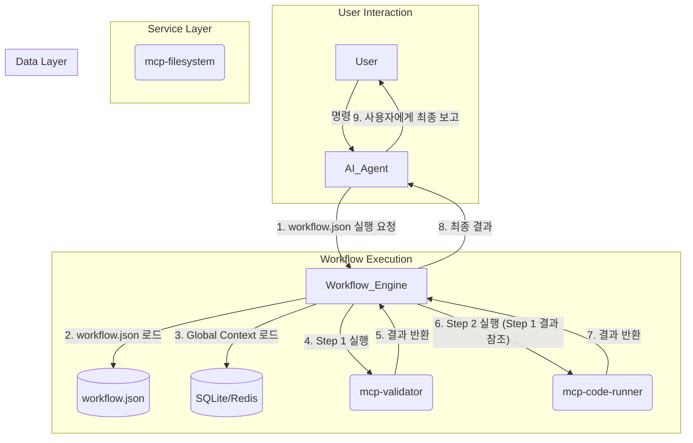

# MCP 기반 워크플로우 자동화 시스템 기술 명세서

## 1. 개요 (Overview)

### 1.1. 목적
본 문서는 AI 에이전트의 개입을 최소화하고, **MCP(Micro-Component Process)**라 불리는 독립적인 기능 단위들의 조합으로 작업을 수행하는 자동화 시스템의 기술적 사양을 정의합니다. 목표는 작업의 일관성, 재현성, 복원력을 극대화하는 것입니다.

### 1.2. 핵심 개념
- **AI-Agent**: 사용자와 상호작용하며, 초기 명령을 해석하여 워크플로우 실행을 트리거하는 역할. **의사결정은 하지 않습니다.**
- **Workflow Engine**: 정의된 워크플로우(`workflow.json`)를 읽어 각 단계를 순차적으로 실행하고, MCP 간의 데이터 흐름을 관리하는 핵심 컨트롤러.
- **MCP (Micro-Component Process)**: 파일 생성, 코드 실행, API 호출 등 단일 책임을 수행하는 독립적인 마이크로서비스. 모든 MCP는 표준화된 API 인터페이스를 따릅니다.
- **Workflow Definition (`workflow.json`)**: 작업의 절차를 정의한 선언적 JSON 파일. MCP 호출 순서, 데이터 전달 방식, 에러 처리 정책을 명시합니다.
- **Global Context (SQLite/Redis)**: 여러 세션과 워크플로우에 걸쳐 유지되어야 하는 상태(사용자 설정, 인증 정보 등)를 저장하는 데이터베이스.

---

## 2. 시스템 아키텍처 (System Architecture)

### 2.1. 흐름도


### 2.2. 구성 요소
| Component | Description | Technology Stack |
|---|---|---|
| **AI-Agent** | 사용자 인터페이스 및 워크플로우 트리거 | Gemini API, Python |
| **Workflow Engine** | JSON 기반 워크플로우 실행 및 상태 관리 | Python, Camunda Platform |
| **MCPs** | 개별 기능을 수행하는 독립 서비스 | Docker, Python/Node.js (FastAPI/Express) |
| **Global Context DB** | 세션 간 데이터 저장소 | SQLite, Redis |

---

## 3. 워크플로우 명세 (Workflow Specification)

워크플로우는 `workflow.json` 파일에 정의되며, 다음 스키마를 따릅니다.

### 3.1. `workflow.json` 스키마
```json
{
  "$schema": "http://json-schema.org/draft-07/schema#",
  "title": "Workflow Definition",
  "type": "object",
  "properties": {
    "name": { "type": "string" },
    "version": { "type": "string", "pattern": "^\d+\.\d+\.\d+$" },
    "description": { "type": "string" },
    "global_params": { "type": "object" },
    "steps": {
      "type": "array",
      "items": {
        "type": "object",
        "properties": {
          "step_id": { "type": "string" },
          "description": { "type": "string" },
          "mcp_id": { "type": "string" },
          "action": { "type": "string" },
          "input": { "type": "object" },
          "output_alias": { "type": "string" },
          "on_error": {
            "type": "object",
            "properties": {
              "retry_count": { "type": "integer", "default": 0 },
              "retry_delay_sec": { "type": "integer", "default": 5 },
              "action": { "enum": ["fail", "continue", "goto"] },
              "goto_step": { "type": "string" }
            }
          }
        },
        "required": ["step_id", "mcp_id", "action"]
      }
    }
  },
  "required": ["name", "version", "steps"]
}
```

### 3.2. 데이터 참조 구문
-   `{{global.key}}`: Global Context의 `key` 값 참조.
-   `{{steps.step_id.output.key}}`: 이전 단계(`step_id`)의 출력 결과 중 `key` 값 참조.

### 3.3. 예시: `workflow.json`
```json
{
  "name": "Create and Run Python Script",
  "version": "1.0.0",
  "global_params": {
    "script_path": "/app/scripts/temp_script.py"
  },
  "steps": [
    {
      "step_id": "create_script",
      "mcp_id": "mcp-filesystem",
      "action": "write_file",
      "input": {
        "path": "{{global.script_path}}",
        "content": "print('Hello from MCP!')"
      },
      "output_alias": "file_creation_result"
    },
    {
      "step_id": "run_script",
      "mcp_id": "mcp-code-runner",
      "action": "execute_python",
      "input": {
        "path": "{{steps.create_script.output.path}}"
      },
      "on_error": {
        "retry_count": 2,
        "action": "fail"
      }
    }
  ]
}
```

---

## 4. MCP API 명세 (MCP API Specification)

모든 MCP는 다음의 표준 API 계약을 준수해야 합니다.

### 4.1. 엔드포인트: `/execute`
-   **Method**: `POST`
-   **Content-Type**: `application/json`

### 4.2. 요청 본문 (Request Body)
```json
{
  "action": "action_name",
  "payload": {
    "param1": "value1",
    "param2": "value2"
  }
}
```

### 4.3. 응답 (Response)
-   **성공 (200 OK)**
    ```json
    {
      "status": "success",
      "data": {
        "output_key": "output_value"
      }
    }
    ```
-   **클라이언트 오류 (400 Bad Request)**
    ```json
    {
      "status": "error",
      "error": {
        "code": "INVALID_PAYLOAD",
        "message": "Parameter 'param1' is missing."
      }
    }
    ```
-   **서버 오류 (500 Internal Server Error)**
    ```json
    {
      "status": "error",
      "error": {
        "code": "INTERNAL_ERROR",
        "message": "An unexpected error occurred."
      }
    }
    ```

---

## 5. 에러 처리 및 복원 (Error Handling & Recovery)

-   **MCP 레벨**: 각 MCP는 자체 오류(예: 파일 접근 불가)를 감지하고 표준 에러 응답을 반환할 책임이 있습니다.
-   **Workflow Engine 레벨**:
    -   `on_error` 정책에 따라 재시도, 건너뛰기, 다른 단계로 이동 등을 처리합니다.
    -   치명적인 오류 발생 시, 현재까지의 실행 상태(완료된 step, 결과)를 **Global Context**에 저장하여 수동 복구를 지원합니다.
-   **콘술에서 실행 되는 스크립트 또는 문서 인코딩**: 한글처리와 이모티콘이 처리 가능하게 인코딩